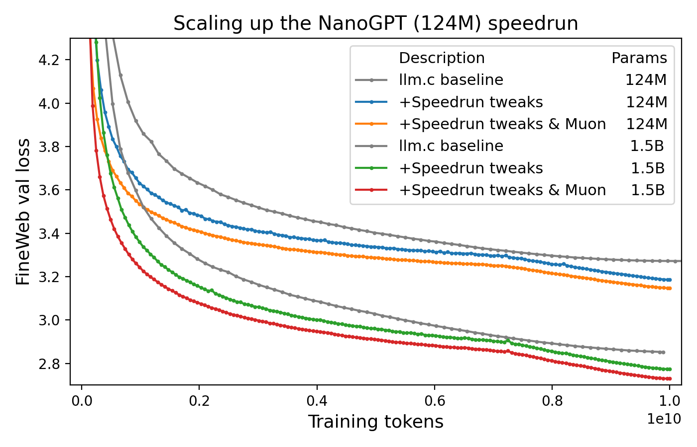
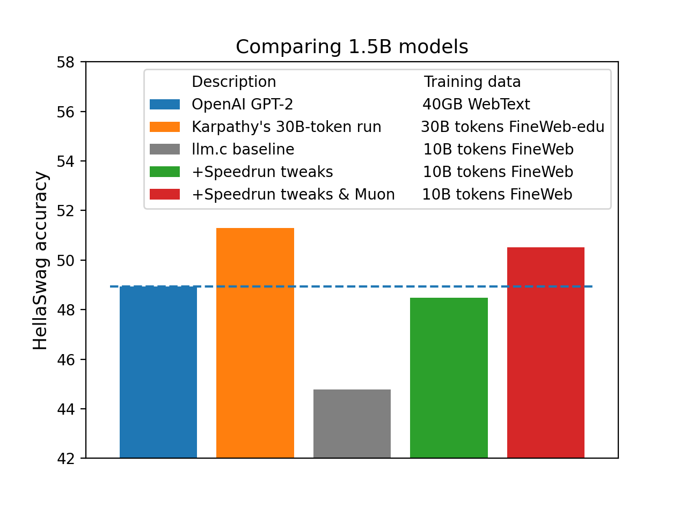
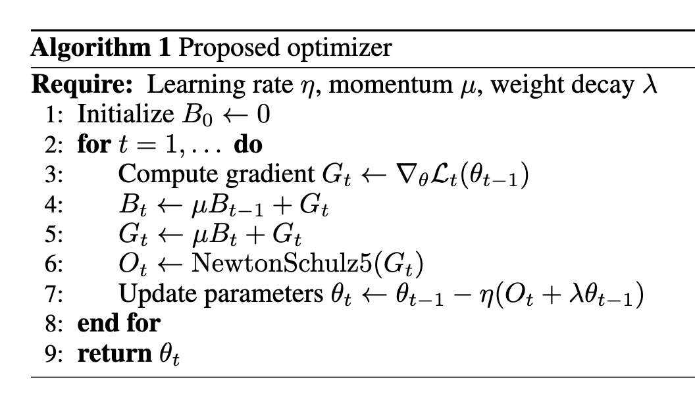

# Modded-NanoGPT

This repository hosts the *NanoGPT speedrun*, in which we (collaboratively|competitively) search for the fastest algorithm to use 8 NVIDIA H100 GPUs to train a language model that attains 3.28 cross-entropy loss on the [FineWeb](https://huggingface.co/datasets/HuggingFaceFW/fineweb) validation set.

The target (3.28 validation loss on FineWeb) follows Andrej Karpathy's [GPT-2 replication in llm.c, which attains that loss after running for 45 minutes](https://github.com/karpathy/llm.c/discussions/481#:~:text=By%20the%20end%20of%20the%20optimization%20we%27ll%20get%20to%20about%203.29).
Furthermore, our training algorithm descends from llm.c's [PyTorch trainer](https://github.com/karpathy/llm.c/blob/master/train_gpt2.py), which itself descends from NanoGPT (hence the name of the repo).
Thanks to many people's contributions, this repo now contains a training algorithm which attains the target performance in:
* 3 minutes on 8xH100 (Andrej's GPT-2 replication needed 45)
* 0.73B tokens (Andrej's GPT-2 replication needed 10B)

This improvement in training performance was brought about by the following techniques:
* Modernized architecture: Rotary embeddings, QK-Norm, and ReLU²
* The Muon optimizer [[writeup](https://kellerjordan.github.io/posts/muon/)] [[repo](https://github.com/KellerJordan/Muon)]
* Untie head from embedding, use FP8 matmul for head, and softcap logits (latter following Gemma 2)
* Projection and classification layers initialized to zero (muP-like)
* Skip connections from embedding to every block as well as between blocks in U-net pattern
* Extra embeddings which are mixed into the values in attention layers (inspired by Zhou et al. 2024)
* FlexAttention with long-short sliding window attention pattern (inspired by Gemma 2) and window size warmup

Contributors list (growing with each new record): [@bozavlado](https://x.com/bozavlado), [@brendanh0gan](https://x.com/brendanh0gan), [@fernbear.bsky.social](https://bsky.app/profile/fernbear.bsky.social), [@Grad62304977](https://x.com/Grad62304977), [@jxbz](https://x.com/jxbz), [@kellerjordan0](https://x.com/kellerjordan0), [@KoszarskyB](https://x.com/KoszarskyB), [@leloykun](https://x.com/@leloykun), [@YouJiacheng](https://x.com/YouJiacheng)

---

## Running the current record

To run the current record, run the following commands.
```bash
git clone https://github.com/KellerJordan/modded-nanogpt.git && cd modded-nanogpt
pip install -r requirements.txt
pip install --pre torch==2.7.0.dev20250110+cu126 --index-url https://download.pytorch.org/whl/nightly/cu126 --upgrade
python data/cached_fineweb10B.py 8 # downloads only the first 800M training tokens to save time
./run.sh
```

**Note: torch.compile will take around 5 minutes the first time you run the code.**

## Alternative: Running with Docker (recommended for timing)

For cases where CUDA or NCCL versions aren't compatible with your current system setup, Docker can be a helpful alternative.
This approach standardizes versions for CUDA, NCCL, CUDNN, and Python, reducing dependency issues and simplifying setup. 
Note: an NVIDIA driver must already be installed on the system (useful if only the NVIDIA driver and Docker are available).

```bash
git clone https://github.com/KellerJordan/modded-nanogpt.git && cd modded-nanogpt
sudo docker build -t modded-nanogpt .
sudo docker run -it --rm --gpus all -v $(pwd):/modded-nanogpt modded-nanogpt python data/cached_fineweb10B.py 8
sudo docker run -it --rm --gpus all -v $(pwd):/modded-nanogpt modded-nanogpt sh run.sh
```

To get an interactive docker, you can use
```bash
sudo docker run -it --rm --gpus all -v $(pwd):/modded-nanogpt modded-nanogpt bash
```

---

## World record history

The following is the historical progression of world speed records for the following competitive task:

> *Train a neural network to ≤3.28 validation loss on FineWeb using 8x NVIDIA H100s.*

Note: The 3.28 target was selected to match [Andrej Karpathy's GPT-2 (small) reproduction](https://github.com/karpathy/llm.c/discussions/481).

| # | Record time | Description | Date | Log | Contributors |
| - | - | - | - | - | - |
1 | 45 minutes | [llm.c baseline](https://github.com/karpathy/llm.c/discussions/481) | 05/28/24 | [log](records/101324_llmc/main.log) | @karpathy, llm.c contributors
2 | 31.4 minutes | [Tuned learning rate & rotary embeddings](https://x.com/kellerjordan0/status/1798863559243513937) | 06/06/24 | [log](records/060624_AdamW/f66d43d7-e449-4029-8adf-e8537bab49ea.log) | @kellerjordan0
3 | 24.9 minutes | [Introduced the Muon optimizer](https://x.com/kellerjordan0/status/1842300916864844014) | 10/04/24 | none | @kellerjordan0, @jxbz
4 | 22.3 minutes | [Muon improvements](https://x.com/kellerjordan0/status/1844820919061287009) | 10/11/24 | [log](records/101024_Muon/eb5659d0-fb6a-49e5-a311-f1f89412f726.txt) | @kellerjordan0, @bozavlado
5 | 15.2 minutes | [Pad embeddings, ReLU², zero-init projections, QK-norm](https://x.com/kellerjordan0/status/1845865698532450646) | 10/14/24 | [log](records/101424_ModernArch/dabaaddd-237c-4ec9-939d-6608a9ed5e27.txt) | @Grad62304977, @kellerjordan0
6 | 13.1 minutes | [Distributed the overhead of Muon](https://x.com/kellerjordan0/status/1847291684016783746) | 10/18/24 | [log](records/101724_DistributedMuon/22d24867-eb5a-4fcc-ae2c-263d0277dfd1.txt) | @kellerjordan0
7 | 12.0 minutes | [Upgraded PyTorch 2.5.0](https://x.com/kellerjordan0/status/1847358578686152764) | 10/18/24 | [log](records/101824_PyTorch25/d4bfb25f-688d-4da5-8743-33926fad4842.txt) | @kellerjordan0
8 | 10.8 minutes | [Untied embedding and head](https://x.com/kellerjordan0/status/1853188916704387239) | 11/03/24 | [log](records/110324_UntieEmbed/d6b50d71-f419-4d26-bb39-a60d55ae7a04.txt) | @Grad62304977, @kellerjordan0
9 | 8.2 minutes | [Value and embedding skip connections, momentum warmup, logit softcap](https://x.com/kellerjordan0/status/1854296101303800108) | 11/06/24 | [log](records/110624_ShortcutsTweaks/dd7304a6-cc43-4d5e-adb8-c070111464a1.txt) | @Grad62304977, @kellerjordan0
10 | 7.8 minutes | [Bfloat16 activations](https://x.com/kellerjordan0/status/1855267054774865980) | 11/08/24 | [log](records/110824_CastBf16/a833bed8-2fa8-4cfe-af05-58c1cc48bc30.txt) | @kellerjordan0
11 | 7.2 minutes | [U-net pattern skip connections & double lr](https://x.com/kellerjordan0/status/1856053121103093922) | 11/10/24 | [log](records/111024_UNetDoubleLr/c87bb826-797b-4f37-98c7-d3a5dad2de74.txt) | @brendanh0gan
12 | 5.03 minutes | [1024-ctx dense causal attention → 64K-ctx FlexAttention](https://x.com/kellerjordan0/status/1859331370268623321) | 11/19/24 | [log](records/111924_FlexAttention/8384493d-dba9-4991-b16b-8696953f5e6d.txt) | @KoszarskyB
13 | 4.66 minutes | [Attention window warmup](https://x.com/hi_tysam/status/1860851011797053450) | 11/24/24 | [log](records/112424_WindowWarmup/cf9e4571-c5fc-4323-abf3-a98d862ec6c8.txt) | @fernbear.bsky.social
14 | 4.41 minutes | [Value Embeddings](https://x.com/KoszarskyB/status/1864746625572257852) | 12/04/24 | [log](records/120424_ValueEmbed) | @KoszarskyB
15 | 3.95 minutes | [U-net pattern value embeddings, assorted code optimizations](https://x.com/YouJiacheng/status/1865761473886347747) | 12/08/24 | [log](records/120824_UNetValueEmbedsTweaks) | @leloykun, @YouJiacheng
16 | 3.80 minutes | [Split value embeddings, block sliding window, separate block mask](https://x.com/YouJiacheng/status/1866734331559071981) | 12/10/24 | [log](records/121024_MFUTweaks) | @YouJiacheng
17 | 3.57 minutes | [Sparsify value embeddings, improve rotary embeddings, drop an attn layer](https://x.com/YouJiacheng/status/1868938024731787640) | 12/17/24 | [log](records/121724_SparsifyEmbeds) | @YouJiacheng
18 | 3.4 minutes | [Lower logit softcap from 30 to 15](https://x.com/kellerjordan0/status/1876048851158880624) | 01/04/25 | [log](records/010425_SoftCap/31d6c427-f1f7-4d8a-91be-a67b5dcd13fd.txt) | @KoszarskyB
19 | 3.142 minutes | [FP8 head, offset logits, lr decay to 0.1 instead of 0.0](https://x.com/YouJiacheng/status/1878827972519772241) | 01/13/25 | [log](records/011325_Fp8LmHead/c51969c2-d04c-40a7-bcea-c092c3c2d11a.txt) | @YouJiacheng
20 | 2.992 minutes | [Merged QKV weights, long-short attention, attention scale, lower Adam epsilon, batched Muon](https://x.com/leloykun/status/1880301753213809016) | 01/16/25 | [log](records/011625_Sub3Min/1d3bd93b-a69e-4118-aeb8-8184239d7566.txt) | @leloykun, @fernbear.bsky.social, @YouJiacheng, @brendanh0gan, @scottjmaddox, @Grad62304977
21 | 2.933 minutes | [Reduced batch size](https://x.com/leloykun/status/1885640350368420160) | 01/26/25 | [log](records/012625_BatchSize/c44090cc-1b99-4c95-8624-38fb4b5834f9.txt) | @leloykun
21 | 2.997 minutes | 21st record with new timing | 02/01/25 | [log](records/020125_RuleTweak/eff63a8c-2f7e-4fc5-97ce-7f600dae0bc7.txt) | not a new record, just re-timing #21 with the [updated rules](#timing-change-after-record-21)

## Rules

The only rules are that new records must:

1. Not modify the train or validation data pipelines. (You can change the batch size, sequence length, attention structure etc.; just don't change the underlying streams of tokens.)
3. Attain ≤3.28 mean val loss. (Due to inter-run variance, submissions must provide enough run logs to attain a statistical significance level of p<0.01 that their mean val loss is ≤3.28. Example code to compute p-value can be found [here](records/010425_SoftCap#softer-softcap).)
2. Not use any extra `torch._inductor.config` flags. (These can save a few seconds, but they can also make compilation take >30min. This rule was introduced after the 21st record.)

Other than that, anything and everything is fair game!

[further clarifications](https://github.com/KellerJordan/modded-nanogpt/discussions/23?sort=new#discussioncomment-12109560)

---

### Comment on the target metric

The target metric is *cross-entropy loss on the FineWeb val set*. To speak mathematically, the goal of the speedrun is *to obtain a probability model of language which assigns a probability of at least `math.exp(-3.28 * 10485760)` to the first 10,485,760 tokens of the FineWeb valset. Hence, e.g., we allow evaluation at any sequence length, so long as we still have a valid probability model of language.

---

### Timing change after record 21

After the 21st record, we made two changes to the timing. First, there used to be an initial "grace period" of 10 untimed steps to allow kernel warmup. We replaced this with an explicit kernel-warmup preamble, which uses dummy data is untimed. This results in an extra runtime of 850ms from the 10 extra timed steps.
Second, we banned the use of `torch._inductor.config.coordinate_descent_tuning`. This saves ~25min of untimed pre-run compilation, but results in an extra runtime of ~3s.

<!--Note: The original llm.c baseline is intended to be closer to a replication of GPT-2 than to an optimized LLM training.
So it's no surprise that there is room to improve; as @karpathy has said, 'llm.c still has a lot of pending optimizations.'
In addition, many of the techniques used in these records are completely standard, such as rotary embeddings.
The goal of this benchmark/speedrun is simply to find out which techniques actually work, and maybe come up with some new ones.-->
<!--The goal of this benchmark is simply to find out all the techniques which actually work, because I'm going crazy reading all these
LLM training papers
which claim a huge benefit but then use their own idiosyncratic non-competitive benchmark and therefore no one in the community has any idea if it's legit for months.-->
<!--[LLM](https://arxiv.org/abs/2305.14342) [training](https://arxiv.org/abs/2402.17764) [papers](https://arxiv.org/abs/2410.01131)-->
<!--I mean hello??? We're in a completely empirical field; it is insane to not have a benchmark. Ideally everyone uses the same LLM training benchmark,
and then reviewing LLM training papers becomes as simple as checking if they beat the benchmark. It's not like this would be unprecedented, that's how things
were in the ImageNet days.
The only possible 'benefit' I can think of for any empirical field to abandon benchmarks is that it would make it easier to publish false results. Oh, I guess that's why it happened.
Hilarious to think about how, in the often-commented-upon and ongoing collapse of the peer review system, people blame the *reviewers* --
yeah, those guys doing free labor who everyone constantly musters all of their intelligence to lie to, it's *their* fault! My bad, you caught me monologuing.-->

---

### Notable attempts & forks

**Notable runs:**

* [@alexjc's 01/20/2025 2.77-minute TokenMonster-based record](https://x.com/alexjc/status/1881410039639863622).
This record is technically outside the rules of the speedrun, since we specified that the train/val tokens must be kept fixed.
However, it's very interesting, and worth including. The run is not more data-efficient; rather, the speedup comes from the improved tokenizer allowing
the vocabulary size to be reduced (nearly halved!) while preserving the same bytes-per-token, which saves lots of parameters and FLOPs in the head and embeddings.

**Notable forks:**
* [https://github.com/BlinkDL/modded-nanogpt-rwkv](https://github.com/BlinkDL/modded-nanogpt-rwkv)
* [https://github.com/nikhilvyas/modded-nanogpt-SOAP](https://github.com/nikhilvyas/modded-nanogpt-SOAP)

---

### Q: What is the point of NanoGPT speedrunning?

A: The officially stated goal of NanoGPT speedrunning is as follows: `gotta go fast`. But for something a little more verbose involving an argument for good benchmarking, here's some kind of manifesto, adorned with a blessing from the master. [https://x.com/karpathy/status/1846790537262571739](https://x.com/karpathy/status/1846790537262571739)

### Q: What makes "NanoGPT speedrunning" not just another idiosyncratic benchmark?

A: Because it is a *competitive* benchmark. In particular, if you attain a new speed record (using whatever method you want), there is an open invitation for you
to post that record (on arXiv or X) and thereby vacuum up all the clout for yourself. I will even help you do it by reposting you as much as I can.

<!--On the contrary, for example, the benchmark used in the [Sophia](https://arxiv.org/abs/2305.14342) paper does *not* have this property.
There is no such open invitation for anyone to compete on the benchmark they used. In particular, if, for a random and definitely not weirdly specific example, you happen to find better AdamW hyperparameters for their training setup than
the ones they used which significantly close the gap between AdamW and their proposed optimizer,
then there is no clear path for you to publish that result in *any* form.
You could try posting it on X.com, but then you would be risking being perceived as aggressive/confrontational, which is *not a good look* in this racket.
So if you're rational, the result probably just dies with you and no one else learns anything
(unless you're in a frontier lab, in which case you can do a nice internal writeup. Boy I'd love to get my hands on those writeups).-->

["Artificial intelligence advances by inventing games and gloating to goad others to play" - Professor Ben Recht](https://www.argmin.net/p/too-much-information)

### Q: NanoGPT speedrunning is cool and all, but meh it probably won't scale and is just overfitting to val loss

A: This is hard to refute, since "at scale" is an infinite category (what if the methods stop working only for >100T models?), making it impossible to fully prove.
Also, I would agree that some of the methods used in the speedrun are unlikely to scale, particularly those which *impose additional structure* on the network, such as logit softcapping.
But if the reader cares about 1.5B models, they might be convinced by this result:

*Straightforwardly scaling up the speedrun (10/18/24 version) to 1.5B parameters yields a model with GPT-2 (1.5B)-level HellaSwag performance 2.5x more cheaply than [@karpathy's baseline](https://github.com/karpathy/llm.c/discussions/677) ($233 instead of $576):*


[[reproducible log](https://github.com/KellerJordan/modded-nanogpt/blob/master/records/102024_ScaleUp1B/ad8d7ae5-7b2d-4ee9-bc52-f912e9174d7a.txt)]


---

## [Muon optimizer](https://github.com/KellerJordan/Muon)

Muon is defined as follows:



Where NewtonSchulz5 is the following Newton-Schulz iteration [2, 3], which approximately replaces `G` with `U @ V.T` where `U, S, V = G.svd()`.
```python
@torch.compile
def zeroth_power_via_newtonschulz5(G, steps=5, eps=1e-7):
    assert len(G.shape) == 2
    a, b, c = (3.4445, -4.7750,  2.0315)
    X = G.bfloat16() / (G.norm() + eps)
    if G.size(0) > G.size(1):
        X = X.T 
    for _ in range(steps):
        A = X @ X.T
        B = b * A + c * A @ A
        X = a * X + B @ X
    if G.size(0) > G.size(1):
        X = X.T 
    return X.to(G.dtype)
```

For this training scenario, Muon has the following favorable properties:
* Lower memory usage than Adam
* ~1.5x better sample-efficiency
* <2% wallclock overhead


### Provenance

Many of the choices made to generate this optimizer were obtained experimentally by our pursuit of [CIFAR-10 speedrunning](https://github.com/KellerJordan/cifar10-airbench).
In particular, we experimentally obtained the following practices:
* Using Nesterov momentum inside the update, with orthogonalization applied after momentum.
* Using a specifically quintic Newton-Schulz iteration as the method of orthogonalization.
* Using non-convergent coefficients for the quintic polynomial in order to maximize slope at zero, and thereby minimize the number of necessary Newton-Schulz iterations.
It turns out that the variance doesn't actually matter that much, so we end up with a quintic that rapidly converges to the range 0.68, 1.13 upon repeated application, rather than converging more slowly to 1.
* Running the Newton-Schulz iteration in bfloat16 (whereas Shampoo implementations often depend on inverse-pth-roots run in fp32 or fp64).

Our use of a Newton-Schulz iteration for orthogonalization traces to [Bernstein & Newhouse (2024)](https://arxiv.org/abs/2409.20325),
who suggested it as a way to compute Shampoo [5, 6] preconditioners, and theoretically explored Shampoo without preconditioner accumulation.
In particular, Jeremy Bernstein @jxbz sent us the draft, which caused us to experiment with various Newton-Schulz iterations as the
orthogonalization method for this optimizer.
If we had used SVD instead of a Newton-Schulz iteration, this optimizer would have been too slow to be useful.
Bernstein & Newhouse also pointed out that Shampoo without preconditioner accumulation is equivalent to steepest descent in the spectral norm,
and therefore Shampoo can be thought of as a way to smooth out spectral steepest descent.
The proposed optimizer can be thought of as a second way of smoothing spectral steepest descent, with a different set of memory and runtime tradeoffs
compared to Shampoo.

---

## Running on fewer GPUs

* To run experiments on fewer GPUs, simply modify `run.sh` to have a different `--nproc_per_node`. This should not change the behavior of the training.
* If you're running out of memory, you may need to reduce the sequence length for FlexAttention (which does change the training. see [here](https://github.com/KellerJordan/modded-nanogpt/pull/38) for a guide)

---

## References

1. [Guilherme Penedo et al. "The fineweb datasets: Decanting the web for the finest text data at scale." arXiv preprint arXiv:2406.17557 (2024).](https://arxiv.org/abs/2406.17557)
2. Nicholas J. Higham. Functions of Matrices. Society for Industrial and Applied Mathematics (2008). Equation 5.22.
3. Günther Schulz. Iterative Berechnung der reziproken Matrix. Z. Angew. Math. Mech., 13:57–59 (1933).
4. [Jeremy Bernstein and Laker Newhouse. "Old Optimizer, New Norm: An Anthology." arxiv preprint arXiv:2409.20325 (2024).](https://arxiv.org/abs/2409.20325)
5. [Vineet Gupta, Tomer Koren, and Yoram Singer. "Shampoo: Preconditioned stochastic tensor optimization." International Conference on Machine Learning. PMLR, 2018.](https://arxiv.org/abs/1802.09568)
6. [Rohan Anil et al. "Scalable second order optimization for deep learning." arXiv preprint arXiv:2002.09018 (2020).](https://arxiv.org/abs/2002.09018)
7. [Alexander Hägele et al. "Scaling Laws and Compute-Optimal Training Beyond Fixed Training Durations." arXiv preprint arXiv:2405.18392 (2024).](https://arxiv.org/abs/2405.18392)
8. [Zhanchao Zhou et al. "Value Residual Learning For Alleviating Attention Concentration In Transformers." arXiv preprint arXiv:2410.17897 (2024).](https://arxiv.org/abs/2410.17897)
9. [Team, Gemma, et al. "Gemma 2: Improving open language models at a practical size." arXiv preprint arXiv:2408.00118 (2024).](https://arxiv.org/abs/2408.00118)
10. [Alec Radford et al. "Language models are unsupervised multitask learners." OpenAI blog 1.8 (2019).](https://cdn.openai.com/better-language-models/language_models_are_unsupervised_multitask_learners.pdf)

## Citation

```
@misc{modded_nanogpt_2024,
  author       = {Keller Jordan and Jeremy Bernstein and Brendan Rappazzo and
                  @fernbear.bsky.social and Boza Vlado and You Jiacheng and
                  Franz Cesista and Braden Koszarsky and @Grad62304977},
  title        = {modded-nanogpt: Speedrunning the NanoGPT baseline},
  year         = {2024},
  url          = {https://github.com/KellerJordan/modded-nanogpt}
}
```


