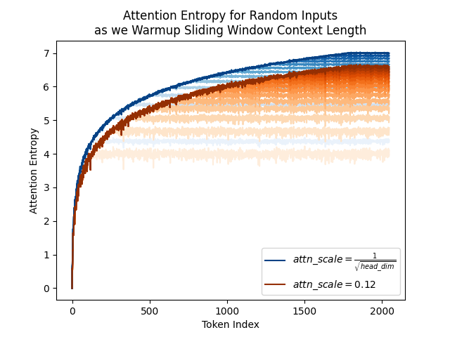
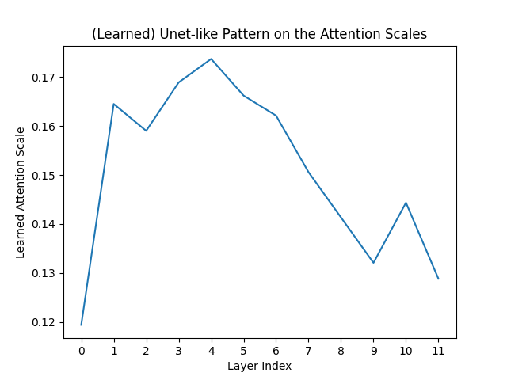

# Sub-3 minute record

## Evidence for <=3.28 mean loss

```bash
$ grep "1393/1393 val" * | python -c "import sys; ss = list(sys.stdin); accs = [float(s.split()[1].split(':')[1]) for s in ss]; print(accs); import scipy.stats; mvs = scipy.stats.bayes_mvs(accs); print(mvs[0]); print(mvs[2]); print(f'p={scipy.stats.ttest_1samp(accs, 3.28, alternative='less').pvalue:.4f}')"
[3.276, 3.2785, 3.2796, 3.2788, 3.2789, 3.2768, 3.2775, 3.2784, 3.2767, 3.2792, 3.2807, 3.2801, 3.2805, 3.2777, 3.2789, 3.2799, 3.2786, 3.2776, 3.2791, 3.2808, 3.2776, 3.2786, 3.2774, 3.2832, 3.277, 3.2789, 3.2784, 3.2766, 3.2755, 3.2784, 3.2798, 3.2825]
Mean(statistic=np.float64(3.27869375), minmax=(np.float64(3.2781784751445135), np.float64(3.2792090248554864)))
Std_dev(statistic=np.float64(0.0017621789337662857), minmax=(np.float64(0.0014271074116428265), np.float64(0.002179878373699496)))
p=0.0001
```

```
Mean runtime: 179.8 seconds
Stddev: 101ms
```

## Details on the changes made

### Long-Short Sliding Window Attention

This attention mechanism is inspired by the Local-Global Attention introduced by the [Gemma 2](https://arxiv.org/abs/2408.00118) paper (and more recent "hybrid" architectures). But there are two key differences:

1. We use [Sliding Window Attention](https://arxiv.org/abs/2004.05150) for both the "global attention" (i.e. "long SWA") and the "local attention" (i.e. "short SWA") parts. The difference between the two is that the "long SWA" has double the context length of the "short SWA".
2. We also **warmup the context length** of both the sliding window attention mechanisms, but **at different rates**. The "long SWA" context length is warmed up at a double the rate compared to the "short SWA".

We also made a speedrun-specific decision to only use "long SWA" in the first, fifth, and last layers. The first, because we do not want to compress information too early in the network. The last, because the model architecture we use for the speedrun follows a UNet-like structure, and we want the first and the last layers to be symmetric. And finally, the fifth layer, mainly because it is empirically the best choice for the speedrun.

This would have been very difficult to implement without PyTorch's [FlexAttention](https://pytorch.org/blog/flexattention/).

```diff
# In GPT.forward...
def dense_to_ordered(dense_mask: torch.Tensor):
    num_blocks = dense_mask.sum(dim=-1, dtype=torch.int32)
-     indices = dense_mask.argsort(dim=-1, descending=True, stable=True).to(torch.int32)
+     indices = dense_mask.argsort(dim=-1, descending=False, stable=True).flip(-1).to(torch.int32)
    return num_blocks[None, None].contiguous(), indices[None, None].contiguous()

- def create_doc_swc_block_mask(sliding_window_num_blocks):
+ def create_doc_swc_block_masks(sliding_window_num_blocks: int):
    kv_idx = block_idx = torch.arange(total_num_blocks, dtype=torch.int32, device='cuda')
    q_idx = block_idx[:, None]
    causal_bm = q_idx >= kv_idx
    causal_full_bm = q_idx > kv_idx
-     window_bm = q_idx - kv_idx < sliding_window_num_blocks
-     window_full_bm = window_bm # block-wise sliding window by @YouJiacheng
    document_bm = (docs_low[:, None] <= docs_high) & (docs_low <= docs_high[:, None])
    document_full_bm = (docs_low[:, None] == docs_high) & (docs_low == docs_high[:, None])
-     nonzero_bm = causal_bm & window_bm & document_bm
-     full_bm  = causal_full_bm & window_full_bm & document_full_bm
    nonzero_bm = causal_bm & document_bm
    full_bm  = causal_full_bm & document_full_bm
    kv_num_blocks, kv_indices = dense_to_ordered(nonzero_bm & ~full_bm)
    full_kv_num_blocks, full_kv_indices = dense_to_ordered(full_bm)
-     return BlockMask.from_kv_blocks(
-         kv_num_blocks,
-         kv_indices,
-         full_kv_num_blocks,
-         full_kv_indices,
-         BLOCK_SIZE=BLOCK_SIZE,
-         mask_mod=document_causal,
-     )
+     def build_bm(sw_num_blocks: Tensor) -> BlockMask:
+         return BlockMask.from_kv_blocks(
+             torch.clamp_max(kv_num_blocks, torch.clamp_min(sw_num_blocks - full_kv_num_blocks, 1)),
+             kv_indices,
+             torch.clamp_max(full_kv_num_blocks, sw_num_blocks - 1),
+             full_kv_indices,
+             BLOCK_SIZE=BLOCK_SIZE,
+             mask_mod=document_causal,
+         )
+     return build_bm(sliding_window_num_blocks), build_bm(sliding_window_num_blocks // 2)

- block_mask = create_doc_swc_block_mask(sliding_window_num_blocks)
+ long_bm, short_bm = create_doc_swc_block_masks(sliding_window_num_blocks)
...
skip_connections = []
# Encoder pass - process only the first half of the blocks
+ block_masks = [long_bm, short_bm, short_bm, short_bm, long_bm, short_bm]
for i in range(self.num_encoder_layers):
-     x = self.blocks[i](x, ve_enc[i], x0, block_mask)
+     x = self.blocks[i](x, ve_enc[i], x0, block_masks[i])
    skip_connections.append(x)
# Decoder pass - process the remaining blocks with weighted skip connections
+ block_masks.reverse()
for i in range(self.num_decoder_layers):
    x = x + self.skip_weights[i] * skip_connections.pop()
-     x = self.blocks[self.num_encoder_layers + i](x, ve_dec[i], x0, block_mask)
+     x = self.blocks[self.num_encoder_layers + i](x, ve_dec[i], x0, block_masks[i])
```

### Attention Scale Modification

We currently use QK-Normalization to stabilize the attention coefficients. This helps [reduce the wallclock time of the speedrun](https://x.com/kellerjordan0/status/1845865698532450646). However, unlike in larger-scale models such as [ViT-22B](https://arxiv.org/pdf/2302.05442) and [Chameleon](https://arxiv.org/pdf/2405.09818v1), we use a parameter-free RMSNorm instead of the usual LayerNorm with learnable parameters.

But while the parameter-free RMSNorm is faster and leads to more stable training runs, it also constrains the logit sharpness and consequently the entropy of the attention coefficients to be in the same range across different layers. And in out setup, this leads to higher attention entropies which means the model is less "certain" which tokens to "attend to" during training. While not problematic early in training as we also don't want the model to overfit early on, it can be problematic later on when we want the model to "focus" on the most important tokens. And the current record is now tight-enough for this to be a problem.



To fix this issue, we first tried out (1) RMSNorm with learned channel-wise parameters and (2) introducing a learned "attention scale" parameter, one for each Attenion layer. Both approaches led to better validation loss, albiet with an extra wallclock overhead. But overall, the speed gain was around 2-3 seconds.

Strangely, the models seem to consistently learn a UNet-like attention scales pattern. And hardcoding this pattern lead to roughly the same results (e.g. `attn_scale(layer_idx) := 0.12 + 0.01 * min(layer_idx, 11 - layer_idx)`). We find this interesting and could be a potential area for future research. But fow now, we offer now explanation why this pattern emerges and why it works well aside from divine intervention.



We eventually settled with simply setting the attention scale to `0.12` (vs. the default `1.0 / sqrt(d_model)`) for all layers. This leads to the same 2-3 sec speed gain as the other three approaches, but with zero overhead.

```diff
# In CausalSelfAttention.__init__
+ self.attn_scale = 0.12
...
# In CausalSelfAttention.forward
- y = flex_attention(q.transpose(1, 2), k.transpose(1, 2), v.transpose(1, 2), block_mask=block_mask)
+ y = flex_attention(q.transpose(1, 2), k.transpose(1, 2), v.transpose(1, 2), block_mask=block_mask, scale=self.attn_scale)
```

### Stacked QKV Weights & Batched Muon Implementation

This is an implementation/compiler-level optimization that leads to a 1-2 secs speed improvement. The crux is that, with a big enough GPU, doing one massive matmul for the QKV weights is faster than doing three smaller matmuls, one for each of the weights.

The problem, however, is that Muon performs better on the unmerged QKV weights primarily due to the massive matmuls in its Newton-Schulz implementation. Our previous implementation involved storing these weights separately as before but concatenating them in the forward pass. But this concatenation operation introduced a slight regression. Finally, we got rid of the overhead by stacking the QKV weights instead and using a batched Muon implementation.

### Adam `eps=1e-10` fix

The speedrun is so tight now that even Adam's default epsilon parameter is already causing problems.

For context, we initialize our LM head as a zero matrix. This leads to small gradients early on in training. And to compound to this, PyTorch's DDP apparently divides the gradients by the number of GPUs first before sending them to the other GPUs. This leads to even smaller gradients which are sometimes even smaller than Adam's default epsilon.

To address this issue, we simply reduced Adam's `eps` from `1e-8` down to `1e-10`.

```diff
- optimizer1 = torch.optim.Adam(adam_params, betas=(0.8, 0.95), fused=True)
+ optimizer1 = torch.optim.Adam(adam_params, betas=(0.8, 0.95), fused=True, eps=1e-10)
```
